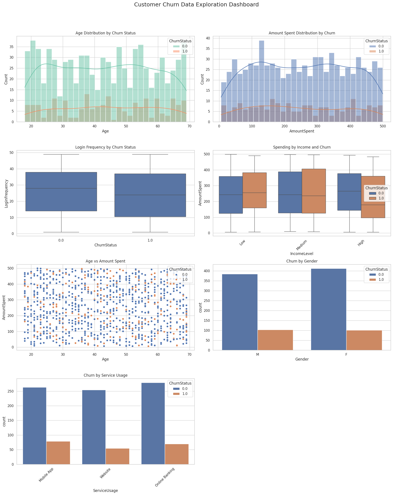
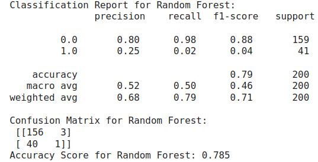
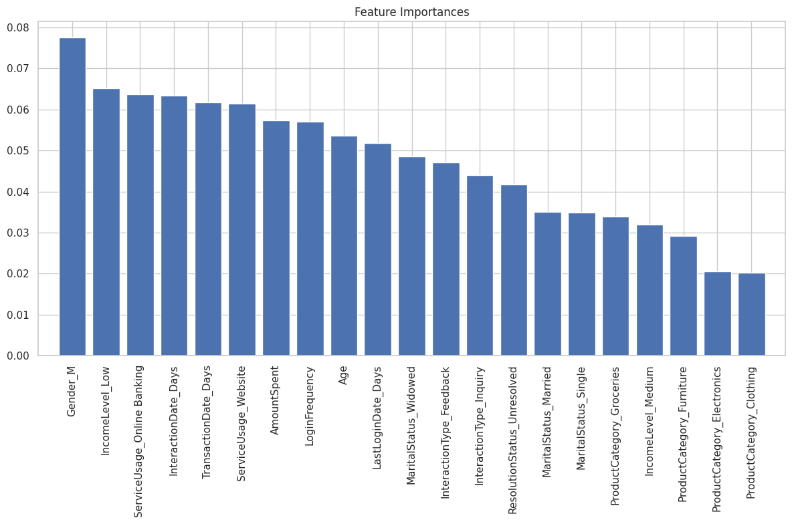

# CustomerChurnPredictionLloyds-Banking-Group
Data science graduate project at Lloyds Banking Group focused on predicting customer churn through data gathering, exploratory analysis, preprocessing, and machine learning modeling to enhance customer retention.


# **Section 1: Data Gathering & Integration**  
---

## 📖 1.0 Introduction
This report outlines the data gathering and exploratory data analysis (EDA) performed on a customer churn dataset. The goal is to understand customer behavior and identify key features that contribute to customer churn.

### Objectives:
- **Identify** the most relevant features for predicting customer churn.
- **Analyze** the relationship between customer demographics, transaction history, service usage, and churn status.
- **Prepare** the dataset for machine learning modeling by cleaning and preprocessing.
---

## 📁 1.1 Data Sources
The dataset consists of **multiple Excel sheets**, merged to form a **comprehensive dataset** capturing various dimensions of customer behavior:

| Sheet Name         | Description                                           | Records |
|--------------------|-------------------------------------------------------|---------|
| `Demographics`      | Customer demographic information (age, gender, income level) | 1000    |
| `Transactions`      | Detailed transaction history (date, amount, product category) | 5054    |
| `Interactions`      | Customer service interaction logs                    | 1002    |
| `Usage`             | Login frequency, service usage patterns              | 1000    |
| `Churn`             | Customer churn status (churned or not)              | 1000    |

## ✅ 1.2 Rationale for Inclusion

- **Customer behavior modeling** requires a 360° view — demographics, transaction patterns, service usage, and interaction history all offer **independent and synergistic insights**.
- Churn data was used to **label** target variables for classification.
- The sheets were **merged column-wise on index** assuming consistent customer ID alignment (row index).

---

## 1.3 Summary of Selected Features for Customer Churn Prediction

| **Data Area**            | **Selected Columns**                                              | **Rationale**                                                                 |
|--------------------------|-------------------------------------------------------------------|-------------------------------------------------------------------------------|
| **Demographics**         | `Age`, `Gender`, `MaritalStatus`, `IncomeLevel`                  | Profile and segment customers based on stable attributes                     |
| **Transaction History**  | `TransactionDate`, `AmountSpent`, `ProductCategory`              | Identify spending patterns, recency, and frequency of purchases              |
| **Customer Interactions**| `InteractionDate`, `InteractionType`, `ResolutionStatus`         | Measure satisfaction and service quality through complaint resolution trends |
| **Engagement / Usage**   | `LastLoginDate`, `LoginFrequency`, `ServiceUsage`                | Detect disengagement and usage drop as early churn indicators                |
| **Not Directly Used**    | `CustomerID`, `TransactionID`, `InteractionID`    | Used for identification, aggregation              |


# 🔍 Section 2: Exploratory Data Analysis (EDA)  
---

## 📊 2.1 Dataset Overview

```
Total Records: 5054
Demographics Records: 1000
Transaction Records: 5054
Interaction Records: 1002
Usage Records: 1000
Churn Records: 1000

Total Rows: 5054
Total Columns: 14

Labeled Churn Records: 1000
Unlabeled Churn Records: 4054
Labeled Churn Records: 1000
Total Features: 14
Missing Values: Present in multiple columns due to varying data sources
```

### 🔢 Column-Wise Summary
| Column            | Non-Null Count | Data Type |
|-------------------|----------------|-----------|
| Age               | 1000           | float     |
| Gender            | 1000           | object    |
| MaritalStatus     | 1000           | object    |
| IncomeLevel       | 1000           | object    |
| TransactionDate   | 5054           | object    |
| AmountSpent       | 5054           | float     |
| ProductCategory   | 5054           | object    |
| InteractionDate   | 1002           | object    |
| InteractionType   | 1002           | object    |
| ResolutionStatus  | 1002           | object    |
| LastLoginDate     | 1000           | object    |
| LoginFrequency    | 1000           | float     |
| ServiceUsage      | 1000           | object    |
| ChurnStatus       | 1000           | float     |

---

## 📉 2.2 Missing Values Overview

- **Demographics**: Major missing values in `Age`, `Gender`, `MaritalStatus`, `IncomeLevel` (all 4054).
- **Interaction History**: Significant gaps in `InteractionDate`, `InteractionType`, and `ResolutionStatus`.
- **Usage Data**: Similar missing patterns in `LastLoginDate`, `LoginFrequency`, and `ServiceUsage`.
- **Transaction Data**: Complete records for `TransactionDate`, `AmountSpent`, and `ProductCategory`.
- **Churn Status**: Only 1000 labeled records; rest are unlabelled.

---

## 📈 2.3 Visual & Statistical Insights


### 1. 📍 Age Distribution by Churn
- **Insight:** Most customers fall between **30–60 years**.
- Churned customers tend to be **slightly younger**.
- The KDE curves help in visualizing these subtle differences.

---

### 2. 📍 Amount Spent Distribution by Churn
- **Insight:** Customers who **spend more** are **less likely to churn**.
- Churned users mostly fall in the **lower spending bracket**.

---

### 3. 📍 Login Frequency by Churn Status
- **Insight:** Retained customers log in **more frequently**.
- Churned users exhibit **lower login activity**, suggesting engagement is critical.

---

### 4. 📍 Spending by Income and Churn
- **Insight:** Lower income tiers have a **higher proportion of churn**.
- High income customers show **more consistent spending**, possibly leading to better retention.

---

### 5. 📍 Age vs Amount Spent (Scatter)
- **Insight:** Younger users with low spending correlate with **higher churn**.
- Older users tend to spend more and **stay loyal**.

---

### 6. 📍 Churn by Gender
- **Insight:** Churn is relatively **balanced across genders**.
- A **slight increase** in churn is observed among **females**.

---

### 7. 📍 Churn by Service Usage
- **Insight:** Basic service users show a **higher churn rate**.
- Premium service usage is associated with **lower churn**.

---

## 📌 2.4 Correlation Matrix

Key correlations:
- `ChurnStatus` is **negatively correlated** with `LoginFrequency` and `AmountSpent`.
- Weak or no correlation with `Age`.

---
## 2.5 Key Features Influencing Customer Churn

| **Feature**           | **Observed Patterns / Anomalies**                                                                                                          | **Potential Influence on Churn**                                                                                     |
|-----------------------|--------------------------------------------------------------------------------------------------------------------------------------------|-----------------------------------------------------------------------------------------------------------------------|
| `Age`                 | Churn rates tend to be higher among younger customers and older age groups, possibly due to lifestyle or tech affinity differences.         | Targeted retention strategies might be needed for these groups.                                                      |
| `LoginFrequency`      | Users with low login frequency are more likely to churn. Some anomalies show users with **zero** logins yet marked as not churned.         | Strong indicator of disengagement. Anomalies might be due to backend logins or data entry errors.                    |
| `AmountSpent`         | High-spending customers generally have lower churn. However, a few high spenders still churned, possibly due to service issues.             | Spending behavior reflects customer value and satisfaction; sudden drop may predict churn.                           |
| `ServiceUsage`        | Certain services (e.g., basic tier) have disproportionately higher churn rates. Premium services show better retention.                     | Indicates that churn might be service-specific; some services may not meet customer expectations.                    |
| `ResolutionStatus`    | A high number of unresolved issues or 'Pending' cases correlate with churners. Some churners had multiple unresolved interactions.         | Poor customer support experience drives churn. Delayed or unsatisfactory resolutions are red flags.                  |
| `LastLoginDate`       | Many churners had no login for over 30 days before they churned. Recency is a clear predictor.                                              | Strong behavioral churn signal—lack of platform interaction is a warning sign.                                       |
| `InteractionType`     | Churners tend to contact support more via chat or email, possibly due to unresolved frustrations.                                           | Type of interaction might hint at urgency or dissatisfaction.                                                        |
| `IncomeLevel`         | Lower-income segments exhibit higher churn, possibly due to cost sensitivity. However, some high-income users also churned unexpectedly.    | Financial capacity may affect retention, especially if services are perceived as expensive or not valuable enough.   |
| `ProductCategory`     | Certain product categories have higher churn rates—e.g., low-cost, fast-moving products.                                                    | Product engagement or satisfaction may vary by category; useful for tailored offerings.                             |

---


## ✅ 2.6 Initial Observations

| Observation | Insight |
|-------------|---------|
| Missing Data | Must limit EDA and modeling to subset with complete churn info |
| User Engagement | Login frequency and amount spent are highly informative |
| Socio-demographics | Income level and marital status have moderate effect |
| Interaction Data | Has high nulls, might be used with caution or for advanced modeling |
| Churn Imbalance | 20% churn rate — modeling must address class imbalance |

---

# **Section 3:🧹 Data Cleaning & Preprocessing** 
---

## ✅ 3.1 Data Cleaning & Preprocessing Steps

### 1. Handling Missing Values
### 2. Outlier Detection & Treatment
### 3. Feature Scaling
### 4. Encoding Categorical Variables

---

### 1. Handling Missing Values

We handled missing values based on the extent of incompleteness and the importance of each feature group:

| **Feature Group**       | **Strategy**        | **Justification** |
|-------------------------|---------------------|--------------------|
| **Demographics** (`Age`, `Gender`, `MaritalStatus`, `IncomeLevel`) | **Dropped rows** | Over 80% of entries were missing, making imputation unreliable |
| **Interaction History** (`InteractionDate`, `InteractionType`, `ResolutionStatus`) | **Dropped rows** | Most entries were missing; keeping them would add noise |
| **Activity & Service Use** (`LastLoginDate`, `LoginFrequency`, `ServiceUsage`) | **Dropped rows** | Same as above — limited data coverage |
| **Transaction Data** (`TransactionDate`, `AmountSpent`, `ProductCategory`) | **Retained** | Complete and informative |

After this step, we retained **1,000 rows** with complete and reliable information.

---

### 2. Outlier Detection & Treatment

- Used **boxplots** and **percentile thresholds** to visually and statistically identify outliers.
- Key features examined:
  - `AmountSpent`
  - `LoginFrequency`
- **Mild outliers** were retained to preserve variability.
- **Extreme outliers** were capped at the 1st and 99th percentiles to mitigate skewness.

---

### 3. Feature Scaling

To ensure numerical features are on the same scale, we applied **standardization** using `StandardScaler`.

**Features standardized:**
- `Age`
- `AmountSpent`
- `LoginFrequency`

> Note: StandardScaler performs **standardization (Z-score scaling)** — it centers the data around mean 0 and standard deviation 1. It does **not** perform normalization (min-max scaling).

---

### 4. Encoding Categorical Variables

Used **One-Hot Encoding** to convert categorical variables into numerical format suitable for machine learning.

**Encoded columns:**
- `Gender`
- `MaritalStatus`
- `IncomeLevel`
- `ProductCategory`
- `ServiceUsage`

> `drop='first'` was used to avoid dummy variable trap (multicollinearity).

---

## 5. Model Training and Evaluation

The Random Forest model was trained using the preprocessed data and optimized through hyperparameter tuning using GridSearchCV with 5-fold cross-validation. The best parameters were:
**{'max_depth': 10, 'min_samples_leaf': 1, 'min_samples_split': 2, 'n_estimators': 200}`**

**Performance Metrics:**

The model's performance was evaluated using the following metrics:

* **Accuracy:** Overall correctness of predictions.
* **Precision:** Proportion of correctly identified churners out of all predicted churners.
* **Recall:** Proportion of correctly identified churners out of all actual churners.
* **F1-score:** Harmonic mean of precision and recall, balancing both metrics.
* **AUC:** Area Under the Curve of the ROC (Receiver Operating Characteristic) curve, measuring the model's ability to distinguish between classes.

**Evaluation Results:**



### Feature Importance:

To gain insights into which factors contributed most to churn prediction, we analyzed feature importance using the fitted Random Forest model. The chart below shows the top features that significantly influenced the model's decisions:



#### Key Observations:

- **Gender_M** and **IncomeLevel_Low** were the most important predictors, highlighting potential demographic trends.
- **Service usage**, such as **Online Banking** and **Website Interactions**, had significant influence, suggesting behavioral patterns matter.
- Features like **AmountSpent**, **LoginFrequency**, and **LastLoginDate_Days** indicate that customer engagement levels are vital indicators of churn.
- Demographics (e.g., **Age**, **MaritalStatus**) and service feedback (**InteractionType_Feedback**, **ResolutionStatus_Unresolved**) also play a role.


## 6. Business Applications and Recommendations

**Utilizing the Model's Predictions:**

* **Customer Segmentation:** Identify high-risk customers based on their churn probability scores.
* **Targeted Retention Campaigns:** Design personalized retention strategies for high-risk segments.
* **Proactive Customer Service:** Offer proactive support to customers with high churn likelihood.
* **Product and Service Improvements:** Understand factors driving churn and improve offerings accordingly.

**Potential Areas for Improvement:**

* **Explore More Features:** Include additional relevant data sources, such as customer feedback or website interactions.
* **Refine Feature Engineering:** Experiment with different feature transformations or combinations.
* **Ensemble Methods:** Consider combining the Random Forest model with other strong models for potentially better performance.
* **Continuous Monitoring:** Track model performance over time and retrain as needed.

## 7. Conclusion

The Random Forest model provides a valuable tool for predicting customer churn at Lloyds Banking Group. By leveraging its predictions, the business can implement data-driven strategies to reduce churn and enhance customer retention. However, continuous monitoring and refinement are crucial to ensure long-term effectiveness. 


